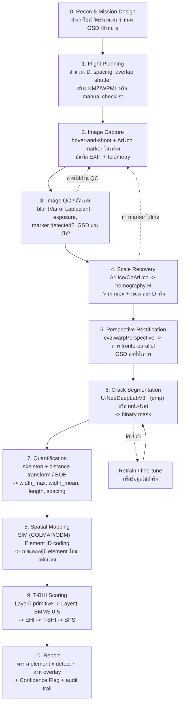

# End-to-End Pipeline สำหรับตรวจสอบรอยแตกเสาตอม่อ/สะพานด้วย UAV + Deep Learning → T-BHI (แผนงานฉบับทำได้จริงสำหรับโปรเจกต์จบ ป.ตรี ม.เกษตรศาสตร์)

> **สรุปคำตอบโจทย์เฉพาะหน้าก่อน (อ่านย่อหน้านี้ก่อนอย่างอื่น)**
>
> 1. **อย่าแก้ปัญหาด้วยการบินเข้าใกล้ ให้แก้ด้วยเลนส์เทเล** — DJI Mavic 4 Pro เลนส์ 168 mm ที่ระยะ **7.8 m** ได้ GSD 0.2 mm/px เท่ากับ Mini 4 Pro ที่ระยะ **1.16 m** (ใกล้เกินไปจนอันตราย) อัตราส่วน **6.7×** คำนวณจาก FOV ที่ DJI ประกาศเอง
> 2. **โดรนห่างวัตถุเท่าไหร่ — อย่าเชื่อ Laser Rangefinder ของโดรน** LRF ของ Matrice 4T มี system error `<0.3 m` ที่ระยะ 1–3 m คือ **ผิด 10–30%** ใช้ทำ scale วัดรอยแตกไม่ได้เลย ([DJI specs](https://enterprise.dji.com/matrice-4-series/specs)) วิธีที่ถูกและฟรีคือ **วาง marker ขนาดที่รู้ (ArUco) ในเฟรม** ซึ่งให้ทั้ง scale + ระยะ + แก้มุมเอียง จากสิ่งเดียว
> 3. **เกณฑ์ T-BHI ของงานคุณเองบอกว่าไม่ต้องวัดถึง 0.2 mm** — ขอบเขตชั้นล่างสุดของ RC Cracking คือ **1.6 mm** และเอกสารระบุเองว่ารอยร้าว `<1 mm` ให้ flag เป็น *Medium Confidence* ⇒ เป้าหมายวิศวกรรมที่ถูกต้องคือ **GSD ≤ 0.2–0.3 mm/px** ไม่ใช่ไล่ 0.05 mm/px ตามงานวิจัยต่างประเทศ

---

# 1. ไดอะแกรมขั้นตอน (End-to-End Pipeline)

## 1.1 ภาพรวม



## 1.2 รายละเอียดแต่ละขั้น (สิ่งที่ต้องระวัง ไม่ใช่แค่ชื่อขั้น)

| # | ขั้น | Input | Output | จุดพลาดที่พบบ่อย |
|---|---|---|---|---|
| 0 | Recon | ภาพถ่ายไซต์, แบบก่อสร้าง | ขนาดเสา (W×H), จำนวน element, ทิศแดด | ไม่รู้ความสูงเสา → คำนวณจำนวนภาพผิด |
| 1 | Flight plan | GSD เป้าหมาย, สเปกกล้อง | D, step_v, step_h, N ภาพ, shutter | ใช้ FOV เป็นแนวนอนทั้งที่ DJI ประกาศเป็น **แนวทแยง** → GSD ผิด 20% |
| 2 | Capture | — | RAW/JPEG + EXIF | บินเคลื่อนที่ถ่าย → motion blur กินความกว้างรอยแตก |
| 3 | QC | ภาพดิบ | ภาพผ่าน/ไม่ผ่าน | ไม่ QC หน้างาน → กลับบ้านแล้วพบว่าเบลอทั้งชุด บินใหม่ไม่ได้ |
| 4 | Scale | ภาพ + marker | mm/px, R,t, D | ใช้ระยะจาก GPS/barometer → ผิดหลายสิบ cm |
| 5 | Rectify | ภาพ + H | ภาพหน้าตรง | ไม่แก้มุมเอียง → รอยแตกกว้างขึ้น/แคบลงตาม cos θ |
| 6 | Segment | ภาพ rectified | mask | เทรนบน dataset ถนน (Crack500) แล้วเอามาใช้กับตอม่อเปียก → generalize ไม่ได้ |
| 7 | Quantify | mask + mm/px | width/length mm | วัดความกว้างตามแนวนอนของภาพแทนแนวตั้งฉากกับ skeleton → เกินจริง |
| 8 | Map back | ภาพชุด + pose | ตำแหน่งบน element | ไม่มีระบบ Element ID → รายงานบอกไม่ได้ว่ารอยอยู่ตอม่อต้นไหน |
| 9 | Scoring | primitive metrics | BMMS level, EHI, T-BHI | ข้ามชั้น Layer 0 ไปทำนายเลข T-BHI ตรง ๆ → ไม่มี audit trail |
| 10 | Report | ทุกอย่าง | PDF/DOCX | ไม่แนบ Confidence Flag → ผู้ใช้เชื่อค่าที่โมเดลไม่มั่นใจ |

## 1.3 หมายเหตุออกแบบสำคัญ 3 ข้อ

**(ก) แยก "โหมดวัด" กับ "โหมดสร้างโมเดล" ออกจากกัน** — ถ้าต้องการแค่ *ความกว้างรอยแตก* แต่ละภาพ scale ตัวเองได้จาก marker ⇒ overlap แค่ 20–30% พอ (แค่ให้ครอบคลุมผิว) แต่ถ้าต้องการ *ผังตำแหน่ง 3D / orthomosaic* ต้อง overlap 80/70 ⇒ จำนวนภาพต่างกัน **~5 เท่า** (ดูตารางข้อ 3.6) แนะนำให้ทำสองรอบบินคนละวัตถุประสงค์ ไม่ใช่รอบเดียวแบบประนีประนอม

**(ข) Layer 0 ต้องเป็น "primitive metrics" ตามที่เอกสาร T-BHI ของคุณเขียนไว้เอง** — คือ AI วัดค่าดิบ (mm, m², %) โดยไม่ผูกกับมาตรฐาน แล้วค่อย map เป็น BMMS 0–5 ในชั้นถัดไป ข้อดีคือถ้ากรมทางหลวงแก้เกณฑ์ ไม่ต้องเทรนโมเดลใหม่ และตรวจย้อนกลับได้ว่าทำไม AI ให้ระดับนั้น (`rawdata/01 Literature Review/1_Foundation/0_[อ่านก่อน] เกณฑ์ประเมิน T-BHI.pdf` หน้า 56)

**(ค) Multi-Path Distress** — ใน element เดียวถ้าพบความเสียหายหลายชนิดที่ระดับต่างกัน ให้ใช้ **ระดับที่แย่ที่สุด** และบันทึก **สัดส่วน** ของแต่ละระดับ (`y_ei`) เพราะสูตร EHI ต้องการ distribution ไม่ใช่ค่าเดียว ⇒ pipeline ต้องคืนค่าเป็น "พื้นที่กี่ % อยู่ระดับ 5/4/3/2/1/0" ไม่ใช่ "ระดับ = 3"

---

# 2. เทคโนโลยีที่แนะนำในแต่ละขั้น

## 2.1 ตารางเลือกเครื่องมือ

| ขั้น | เครื่องมือแนะนำ | License | ทางเลือกอื่น | เหตุผลที่เลือก |
|---|---|---|---|---|
| Camera calibration | `cv2.calibrateCamera` + ChArUco board | Apache-2.0 | Kalibr | อยู่ใน OpenCV อยู่แล้ว ไม่ต้องลงอะไรเพิ่ม ChArUco แม่นกว่า checkerboard เพราะทนการบังบางส่วน |
| Blur QC | `cv2.Laplacian(img).var()` | Apache-2.0 | BRISQUE, FFT | 3 บรรทัด รันหน้างานบนโน้ตบุ๊กได้ ตั้ง threshold จาก Phase 0 |
| Marker/scale | `cv2.aruco` (DICT_5X5_100) + ChArUco | Apache-2.0 | AprilTag, เทปวัดในเฟรม | ให้ scale + pose + rectification จากของชิ้นเดียว ค่า default `minMarkerPerimeterRate=0.03` |
| Perspective | `findHomography` + `warpPerspective` | Apache-2.0 | `estimatePoseSingleMarkers` | ตรงไปตรงมา ควบคุม GSD ปลายทางได้เอง |
| Crack segmentation | **segmentation-models-pytorch** (U-Net / DeepLabV3+ + timm encoder) | **MIT** | nnU-Net, SAM-based | MIT สะอาดสุดสำหรับวิทยานิพนธ์ที่อาจต่อยอดเชิงพาณิชย์ มี pretrained encoder เยอะ เทรนได้บน Colab ฟรี |
| Crack detection (screening) | Ultralytics YOLO11-seg | **AGPL-3.0** | RT-DETR, mmdetection | เร็ว ใช้ง่าย **แต่ AGPL** — ถ้าไม่เปิด source ทั้งโปรเจกต์ต้องซื้อ Enterprise License |
| Baseline (ต้องมี!) | Adaptive threshold + morphology + `skeletonize` (scikit-image) | BSD | Canny + Hough | เป็นตัวเปรียบเทียบว่า DL ดีกว่าจริงไหม อาจารย์จะถามแน่นอน |
| Width quantification | `skimage.morphology.medial_axis` + distance transform, หรือ EOB | BSD | stereovision | มีในไลบรารีมาตรฐาน; งาน MAT ปรับปรุงรายงาน error สูงสุด **2.09 px** |
| SfM / photogrammetry | **COLMAP** | BSD | ODM/WebODM (AGPL), Metashape (จ่ายเงิน) | คุณภาพ research-grade, scriptable **ข้อจำกัดสำคัญ: COLMAP ไม่มีฟังก์ชัน scaling ในตัว** ต้อง post-scale ด้วย scale bar เอง |
| Orthophoto/GCP | ODM/WebODM | AGPL-3.0 | — | มี GCP workflow พร้อม ถ้าต้องการ ortho ของหน้าเสา |
| Element ID / spatial framework | อ้างอิง Gou et al. (2026) ที่อยู่ใน lit review ของคุณแล้ว | — | IFC/BIM | อย่าออกแบบ coding system เอง ใช้ของที่มีงานตีพิมพ์รองรับ |
| Reporting | Python + Jinja2 + WeasyPrint | BSD/LGPL | python-docx | ออก PDF ภาษาไทยได้ ใช้ font Sarabun |

## 2.2 เหตุผลเชิงลึกในจุดที่คนมักเลือกผิด

**ทำไมไม่ใช้ Ultralytics เป็นตัวหลัก** — สัญญาอนุญาต AGPL-3.0 บังคับว่าถ้าใช้โค้ด/โมเดล/น้ำหนักที่ fine-tune แล้ว ต้องเปิดซอร์สทั้งงาน รวมถึงสคริปต์และไฟล์คอนฟิก ([Ultralytics License](https://www.ultralytics.com/license), [Issue #19390](https://github.com/ultralytics/ultralytics/issues/19390)) สำหรับวิทยานิพนธ์ที่จะเผยแพร่ open-source อยู่แล้วไม่มีปัญหา แต่ถ้ามหาวิทยาลัย/วช. อยากต่อยอดเป็นผลิตภัณฑ์ จะติดทันที **segmentation-models-pytorch เป็น MIT** จึงปลอดภัยกว่าและเหมาะกับ semantic segmentation (ซึ่งคือสิ่งที่ crack ต้องการ) มากกว่า instance segmentation อยู่แล้ว

**ทำไม COLMAP ไม่ใช่ Metashape** — Metashape มี scale bar + GCP workflow ในตัวและ dense cloud สะอาดกว่า แต่มีค่าลิขสิทธิ์ COLMAP ฟรีและ scriptable แต่ **ต้องเขียน post-scaling เอง** ซึ่งจริง ๆ เป็นข้อดีสำหรับวิทยานิพนธ์ เพราะได้อธิบายวิธี scale ในบทระเบียบวิธีวิจัยแทนที่จะเป็นกล่องดำ ([เปรียบเทียบเครื่องมือ, ISPRS 2022](https://isprs-archives.copernicus.org/articles/XLIII-B2-2022/141/2022/isprs-archives-XLIII-B2-2022-141-2022.pdf))

**Dataset ที่ควรใช้** — ควรใช้ **OmniCrack30k** เป็นฐาน: 30k ภาพจาก 20+ dataset ครอบคลุม asphalt/ceramic/concrete/masonry/steel รวม 9 พันล้านพิกเซล และ nnU-Net บนชุดนี้ได้ mean clIoU₄ₚₓ = **64%** ซึ่งเป็น "แถบเปรียบเทียบ" ที่ดีสำหรับตั้ง success criteria ([CVPRW 2024](https://openaccess.thecvf.com/content/CVPR2024W/VAND/papers/Benz_OmniCrack30k_A_Benchmark_for_Crack_Segmentation_and_the_Reasonable_Effectiveness_CVPRW_2024_paper.pdf), [GitHub](https://github.com/ben-z-original/omnicrack30k)) เสริมด้วย **CrackSeg9k** (9,255 ภาพ 400×400) สำหรับ prototype เร็ว ๆ

**Hardware สำหรับวัดระยะ (ถ้าอยากทำจริง)** — TF-Luna ราคาถูก น้ำหนัก ~5 g ระยะ 0.2–8 m ความละเอียด 1 cm **ความแม่น ±6 cm ที่ 0.2–3 m** ([Benewake](https://en.benewake.com/TFLuna/index.html)) ดีกว่า LRF ของ M4T หลายเท่าในช่วงใกล้ แต่ยังคิดเป็น error 2% ที่ 3 m ⇒ **ยังไม่พอสำหรับ scale ระดับ mm** ใช้เพื่อ *ความปลอดภัย/รักษาระยะ* ได้ แต่ scale ต้องมาจาก marker งานที่ทำได้จริงคือแบบ 4 จุดเลเซอร์ + homography ซึ่งรายงาน error ระยะ 700 mm ได้ **0.78 mm** ([PMC5940778](https://www.ncbi.nlm.nih.gov/pmc/articles/PMC5940778/))

---

# 3. สูตรคำนวณสำคัญทั้งหมด พร้อมที่มา

## 3.1 GSD — ใช้ฟอร์มไหนดี

**ฟอร์ม A (เซนเซอร์):**
```
GSD [mm/px] = (D [mm] × sensor_width [mm]) / (f [mm] × image_width [px])
```
([Skyebrowse](https://www.skyebrowse.com/news/posts/ground-sample-distance), [JOUAV](https://www.jouav.com/blog/ground-sample-distance.html))

**ฟอร์ม B (pixel pitch):**
```
GSD = D × p / f      เมื่อ p = ขนาดพิกเซล
```

**ฟอร์ม C (FOV — แนะนำที่สุดสำหรับโดรน DJI):**
```
GSD = D × 2·tan(FOV/2) / N_diag        N_diag = √(W_px² + H_px²)
```

**ทำไมแนะนำฟอร์ม C** — DJI ประกาศ FOV และจำนวนพิกเซลอย่างเป็นทางการ แต่ **ไม่ประกาศขนาดเซนเซอร์จริงเป็น mm และไม่ประกาศ actual focal length** (ตรวจสอบแล้วในหน้า specs ของ Mavic 4 Pro: "actual focal length: not specified") การไปหาขนาด "1/1.3 นิ้ว" จากเว็บทั่วไปได้ค่าขัดกัน (9.6×7.2 vs 9.8×7.3 mm) ⇒ เดา

**⚠ กับดักที่ทำให้ GSD ผิด 20%: FOV ของ DJI เป็นแนวทแยง ไม่ใช่แนวนอน** พิสูจน์ด้วยการตรวจสอบไขว้:

| กล้อง | equiv. FL | คำนวณ diag FOV = 2·atan(43.27/(2·f_eq)) | DJI ประกาศ | ต่างกัน |
|---|---|---|---|---|
| Mini 4 Pro | 24 mm | 84.1° | **82.1°** | 2.4% |
| Mavic 4 Pro tele | 168 mm | 14.7° | **15°** | 2.0% |
| Mavic 4 Pro wide | 28 mm | 75.4° | **72°** | 4.5% |

ถ้าตีความเป็นแนวนอน Mini 4 Pro จะได้ GSD 0.648 mm/px ที่ 3 m ซึ่งขัดกับฟอร์ม B (0.536 mm/px) ถึง 21% แต่ถ้าตีความเป็นแนวทแยงได้ 0.518 mm/px ต่างจากฟอร์ม B แค่ **3.4%** ⇒ ยืนยันว่าเป็นแนวทแยง

## 3.2 ตาราง GSD จริงของกล้องที่หาได้ในไทย

**DJI Mini 4 Pro** (48 MP = 8064×6048, N_diag = 10,080 px, FOV 82.1°) → `GSD = D[mm] × 1.727e-4`

| ระยะ D | GSD (48MP) | GSD (12MP) | รอยแตกเล็กสุดที่ตรวจได้ (3×GSD) |
|---|---|---|---|
| 1.16 m | **0.20 mm/px** | 0.40 | 0.60 mm |
| 2 m | 0.35 | 0.69 | 1.04 mm |
| 3 m | 0.52 | 1.04 | 1.55 mm |
| 5 m | 0.86 | 1.73 | 2.59 mm |
| 10 m | 1.73 | 3.45 | 5.18 mm |

**DJI Mavic 4 Pro เลนส์ tele 168 mm** (50 MP = 8192×6144, N_diag = 10,240 px, FOV 15°) → `GSD = D[mm] × 2.571e-5`

| ระยะ D | GSD | รอยแตกเล็กสุด (3×GSD) | ความเห็น |
|---|---|---|---|
| 5 m | 0.13 mm/px | 0.39 mm | ดีเกินพอ |
| 7.8 m | **0.20** | 0.60 mm | **จุดที่แนะนำ** |
| 11.7 m | 0.30 | 0.90 mm | ยังผ่าน |
| 19.4 m | 0.50 | 1.50 mm | เริ่มไม่พอ |
| 30 m | 0.77 | 2.31 mm | แค่ screening |

> **ข้อควรระวังที่ต้องเขียนในวิทยานิพนธ์:** เซนเซอร์ 48 MP บนโดรน DJI เป็น **quad-Bayer/pixel-binning** โหมด 48 MP ไม่ได้ให้ optical resolution 48 MP จริง แหล่งข่าวรีวิวระบุว่า "เรียก 48MP แต่จริง ๆ คือ 12MP ที่ผ่าน trickery" ([PetaPixel](https://petapixel.com/2023/11/29/dji-mini-4-pro-review-ultra-light-without-compromises/)) ⇒ **ต้องวัด effective resolution จริงด้วย resolution target (Siemens star / USAF 1951) ใน Phase 0 ห้ามเชื่อตัวเลข nominal** ถ้าผลออกมาว่า effective GSD แย่กว่า nominal 1.4× ให้คูณระยะ D ที่คำนวณได้ด้วย 1/1.4

## 3.3 ระยะบินที่ต้องใช้เพื่อได้ GSD เป้าหมาย

```
D [mm] = GSD_target [mm/px] × N_diag / (2·tan(FOV/2))
```
- Mini 4 Pro 48MP: `D = GSD × 5,791`
- Mavic 4 Pro tele: `D = GSD × 38,890`

**เป้าหมาย GSD ควรตั้งเท่าไหร่ — ให้เกณฑ์ T-BHI ของคุณเป็นตัวกำหนด ไม่ใช่งานวิจัยต่างประเทศ**

เกณฑ์ RC Cracking ใน T-BHI (ตารางที่ 4.3.1):

| ระดับ BMMS | AASHTO CS | ความกว้าง | ช่วงกว้าง |
|---|---|---|---|
| 4 (ดีพอใช้) | CS1.5 | < 1.6 mm | — |
| 3 (พอใช้) | CS2 | 1.6–3.2 mm | 1.6 mm |
| 2 (ชำรุด) | CS3 | 3.2–4.8 mm | 1.6 mm |
| 1 (วิกฤติ) | CS3.5 | > 4.8 mm | — |

ช่วงชั้นกว้าง **1.6 mm** เท่ากันทุกชั้น หลักการวัด: ความไม่แน่นอน 95% ควร ≤ ¼ ของช่วงชั้น = **0.4 mm** ถ้าความคลาดเคลื่อนของการวัดความกว้าง ≈ 2 px (อ้างงาน improved MAT ที่รายงาน error สูงสุด 2.09 px) จะได้

```
GSD_required ≤ 0.4 mm / 2 px = 0.20 mm/px
```

⇒ **เป้าหมาย GSD = 0.20 mm/px, ยอมรับได้ 0.30, ไม่ผ่านถ้า > 0.50**

และเกณฑ์ T-BHI เองก็เขียนไว้ (ชั้นที่ 2, หน้า 56) ว่ารอยร้าวที่ระบุความกว้างต่ำกว่า 1 mm ไม่ได้ ให้เป็น **"Medium Confidence"** ⇒ ระบบไม่ต้องแม่นระดับ 0.05 mm แบบงานวิจัยที่อ้าง GSD 0.1 mm/px ที่ระยะ 5 m ซึ่งเป็นสเปกเลนส์ที่นักศึกษาไม่มี

**⇒ ผลลัพธ์เชิงนโยบายของโปรเจกต์: Mini 4 Pro ไม่พอสำหรับวัดความกว้างระดับ T-BHI ที่ระยะปลอดภัย** (ต้องบิน 1.16 m ซึ่งใกล้เกิน) ⇒ ต้องเลือกทางใดทางหนึ่ง:
- (ก) ยืมโดรนที่มีเลนส์เทเล (Mavic 3 Pro / Mavic 4 Pro / Matrice)
- (ข) ใช้โดรนเป็น **screening** (หารอยแตกว่าอยู่ตรงไหน) แล้วใช้กล้องพื้นดิน+เลนส์เทเล หรือกล้องบนไม้ค้ำ วัดความกว้างเฉพาะจุด ← **แนะนำที่สุดสำหรับงบนักศึกษา** และตรงกับที่ FHWA ระบุว่า UAS ยังไม่ทดแทน hands-on inspection แต่ช่วยเป็นภาพเบื้องต้นได้ ([FHWA-HIF-19-056](https://www.fhwa.dot.gov/innovation/everydaycounts/edc_5/docs/uas-factsheet.pdf))

## 3.4 ขนาด marker ขั้นต่ำ

มี **สองข้อจำกัด** ต้องผ่านทั้งคู่:

**(1) ข้อจำกัดของอัลกอริทึม detection**
```
side_px ≥ minMarkerPerimeterRate × max(W_px, H_px) / 4
```
ค่า default `minMarkerPerimeterRate = 0.03` ([OpenCV DetectorParameters](https://docs.opencv.org/4.x/d1/dcd/structcv_1_1aruco_1_1DetectorParameters.html))
- ภาพ 8064×6048 → `side_px ≥ 0.03 × 8064 / 4 = 60.5 px`

**⚠ นี่คือกับดัก** — คนส่วนใหญ่จำแค่ "20–30 px ก็พอสำหรับ dict 4×4" ([OpenCV tutorial](https://docs.opencv.org/4.x/d5/dae/tutorial_aruco_detection.html)) แต่บนภาพ 48 MP ค่า default บังคับ **61 px** ซึ่งเข้มกว่า 2–3 เท่า ถ้าจะใช้ marker เล็กกว่านั้นต้องลด `minMarkerPerimeterRate` เอง

**(2) ข้อจำกัดของความแม่นยำ scale** — ความคลาดเคลื่อนของ scale ≈ ความคลาดเคลื่อนมุม (px) ÷ ขนาด marker (px) ด้วย `CORNER_REFINE_SUBPIX` (`cornerRefinementMinAccuracy = 0.1`) จะได้มุมแม่น ~0.1–0.3 px:

| side_px | scale error | เหมาะกับ |
|---|---|---|
| 61 | 0.16–0.49% | ขั้นต่ำสุด ไม่แนะนำ |
| 100 | 0.10–0.30% | พอใช้ |
| **200** | **0.05–0.15%** | **แนะนำ** |
| 400 | 0.03–0.08% | Phase 0 lab |

**สูตรขนาด marker จริง:**
```
S_marker [mm] ≥ 200 px × GSD [mm/px]
```

| GSD เป้า | S_marker ขั้นต่ำ | ขนาดที่ควรพิมพ์จริง |
|---|---|---|
| 0.20 mm/px | 40 mm | **50 mm** (พิมพ์ A5) |
| 0.30 | 60 mm | 80 mm |
| 0.50 | 100 mm | 120 mm |
| 1.73 (Mini @10 m) | 346 mm | **A3 (420 mm)** |

**เชิงประจักษ์:** ArUco 10 cm ที่ระยะ 1 m ให้ความแม่นตำแหน่ง ±5–10 mm (0.5–1.0%) และ ±30 mm ที่ 3 m ⇒ **ยิ่งไกลยิ่งแย่เร็ว** ควรวาง marker หลายอันกระจายบนหน้าเสา ไม่ใช่อันเดียว และควรใช้ **ChArUco board** แทน marker เดี่ยวเพราะให้จุดมุมเป็นสิบ ๆ จุดต่อบอร์ด ลด error แบบ √n

## 3.5 Overlap → ระยะห่างระหว่างจุดถ่าย

```
w_fp [m] = GSD [mm/px] × W_px / 1000        (footprint กว้าง)
h_fp [m] = GSD [mm/px] × H_px / 1000        (footprint สูง)

step_side  = w_fp × (1 − overlap_side)
step_front = h_fp × (1 − overlap_front)
```

**ค่า overlap ที่ควรใช้** (จาก OpenDroneMap [Flying Tips](https://docs.opendronemap.org/flying/)):

| วัตถุประสงค์ | front | side | หมายเหตุ |
|---|---|---|---|
| Full 3D reconstruction (nadir) | 60% | 60% | ต่ำสุดที่ยังได้โมเดล |
| Full 3D (cross-grid 45°) | 70–80% | 70–80% | แนะนำสำหรับตอม่อ |
| 2D/2.5D ortho ฉากซับซ้อน | 80–83% | 80–83% | ผิวคอนกรีตเรียบ = ฉากซับซ้อน (texture น้อย) |
| **โหมดวัดอย่างเดียว (marker-scaled)** | **20–30%** | **20–30%** | แค่ให้ผิวต่อเนื่อง ไม่ต้องทำ SfM |

**⚠ ผิวคอนกรีตทาสี/เรียบ = ศัตรูของ SfM** เพราะ feature น้อย ⇒ ต้องใช้ overlap สูงกว่าที่แนะนำสำหรับพื้นดินทั่วไป ให้ตั้ง **80/70 เป็นค่าเริ่ม** และเพิ่มเป็น 85 ถ้า COLMAP register ภาพได้ < 95%

**ตัวอย่างจริง — Mini 4 Pro 48MP ที่ D = 3 m (GSD 0.518):**
- w_fp = 0.518 × 8064 / 1000 = **4.18 m**, h_fp = **3.13 m**
- overlap 80/70 → step_front = 3.13 × 0.2 = **0.63 m**, step_side = 4.18 × 0.3 = **1.25 m**

## 3.6 Shutter speed สูงสุด

```
motion_blur [mm] = v [m/s] × t [s] × 1000
เงื่อนไข: blur ≤ k × GSD          (k = 1 ทั่วไป, k = 0.5 สำหรับงานวัดความกว้าง)

⇒ t_max [s] = k × GSD [mm/px] / (v [m/s] × 1000)
```
กฎ "blur ไม่ควรเกิน 1×GSD" มาจากแนวปฏิบัติ photogrammetry ([Hammer Missions](https://www.hammermissions.com/post/preventing-motion-blur-in-drone-photogrammetry-flights), [Richard Hann/NTNU](https://www.ntnu.no/blogger/richard-hann/2021/10/07/preventing-motion-blur-in-drone-mapping/))

| GSD | v = 2 m/s | v = 1 m/s | v = 0.5 m/s | v ≈ 0 (hover) |
|---|---|---|---|---|
| 0.2 mm/px (k=0.5) | 1/20000 ❌ | 1/10000 ❌ | 1/5000 | จำกัดที่ jitter |
| 0.3 (k=0.5) | 1/13300 ❌ | 1/6700 ❌ | 1/3300 | — |
| 0.5 (k=0.5) | 1/8000 ⚠ | 1/4000 | 1/2000 | — |
| 0.5 (k=1) | 1/4000 | 1/2000 | 1/1000 | — |

**สรุปสูตรนี้บอกอะไร:** ที่ GSD 0.2 mm/px **บินถ่ายไปด้วยไม่ได้เลย** ต้อง `1/20000 s` ซึ่งเกินความสามารถกล้อง (Mini 4 Pro สูงสุด 1/8000 s ในโหมด 48MP, 1/16000 s ในโหมด 12MP — [DJI specs](https://www.dji.com/mini-4-pro/specs))

⇒ **บังคับใช้ hover-and-shoot** ที่ทุกจุด waypoint ค้างนิ่ง ≥ 1 s ก่อนกดชัตเตอร์ แล้วตัวจำกัดจริงกลายเป็น *การสั่น/ลอยของโดรน* ไม่ใช่การเคลื่อนที่ไปข้างหน้า → ตั้ง **shutter ≥ 1/1000 s, ISO ≤ 400** เป็นค่าเริ่ม แล้ว calibrate ค่าจริงใน Phase 0 ด้วย Var-of-Laplacian

**⚠ ปัญหาที่จะเจอจริง:** ใต้สะพาน/ด้านเงาของตอม่อแสงน้อย ที่ f/1.7 + 1/1000 s + ISO 400 อาจ underexpose 2–3 stop ⇒ ต้องยอม ISO 800–1600 (noise เพิ่ม → segmentation แย่ลง) หรือหาช่วงเวลาที่แดดส่องด้านนั้น ⇒ **ต้องวางแผนทิศแดดตั้งแต่ขั้น Recon** นี่คือเหตุผลที่ขั้น 0 อยู่ในไดอะแกรม

## 3.7 จำนวนภาพต่อเสา 1 ต้น

```
N_rows = ceil(H_face / step_front) + 1
N_cols = 2                          ถ้า w_fp ≥ W_face   (ถ่าย 2 มุมเพื่อ multi-view)
       = ceil(W_face / step_side) + 1   ถ้าไม่ใช่
N_face = N_rows × N_cols
N_pier = 4 หน้า × N_face × (1 + k_oblique)      k_oblique = 1.0 (cross-grid 45° เต็ม), 0.5 (มุมเสาเท่านั้น), 0 (nadir อย่างเดียว)
```

**ตัวอย่าง: ตอม่อ RC สี่เหลี่ยม 1.5 × 1.5 m สูง 8 m**

| กรณี | กล้อง | D | GSD | h_fp | step_front | N_rows | N_face | **N_pier (k=0.5)** | เวลาบิน @4 s/ภาพ |
|---|---|---|---|---|---|---|---|---|---|
| A | Mini 4 Pro 48MP | 3 m | 0.52 | 3.13 m | 0.63 m | 14 | 28 | **168** | 11 นาที |
| B | Mavic 4 tele | 7.8 m | 0.20 | 1.23 m | 0.25 m | 34 | 68 | **408** | 27 นาที |
| C | Mavic 4 tele | 19.4 m | 0.50 | 3.16 m | 0.63 m | 14 | 28 | **168** | 11 นาที |
| **D** | **Mini 4 Pro, โหมดวัดอย่างเดียว** (overlap 30%) | 3 m | 0.52 | 3.13 m | 2.19 m | 5 | 5 | **20** | 1.5 นาที |

**อ่านตารางนี้ยังไง:**
- กรณี B ให้ GSD ที่ผ่านเกณฑ์ T-BHI แต่ **408 ภาพ / 27 นาที ต่อเสาต้นเดียว** ⇒ Mini 4 Pro บินได้ 34 นาที ⇒ **1 แบตต่อ 1 เสา ไม่มีเผื่อ** ต้องพก ≥ 3 แบต และสะพาน 5 ตอม่อ = 2,040 ภาพ ~40 GB
- กรณี D คือทางลัดที่ควรใช้ตอน Phase 1: ถ้าไม่ต้องสร้างโมเดล 3D ใช้แค่ 20 ภาพ/เสา **ลดลง 8 เท่า**
- ⇒ **แนะนำ 2 รอบบิน**: รอบ 1 โหมดวัด (20 ภาพ, GSD ละเอียด) + รอบ 2 โหมดโมเดล (GSD หยาบกว่า, overlap สูง, ~60 ภาพ) รวม 80 ภาพ ได้ทั้งความแม่นและตำแหน่ง

---

# 4. แผนงานเป็นเฟส พร้อมเกณฑ์ผ่านที่วัดเป็นตัวเลข

## Phase 0 — ห้องแล็บ / กำแพงทดสอบ (ไม่ใช้โดรน) — 6–8 สัปดาห์

**เป้าหมาย:** พิสูจน์ว่า *สายโซ่การวัด* (ภาพ → mm) ถูกต้อง ก่อนเอาความไม่แน่นอนของโดรนเข้ามาปน

**ทำอะไร:** กล้อง (มือถือ/DSLR/กล้องโดรนถอดออกไม่ได้ก็ถือโดรนด้วยมือ) บนขาตั้ง ถ่ายกำแพงคอนกรีตที่มีรอยแตกจริง หรือแผ่นทดสอบที่กรีดรอยความกว้างที่ทราบค่า ระยะ 1/2/3 m มุม 0°/15°/30°/45°

**Success criteria (ต้องผ่านทุกข้อ):**

| # | เกณฑ์ | ค่าเป้าหมาย | วิธีวัด |
|---|---|---|---|
| 0.1 | Camera calibration RMS reprojection error | **≤ 0.5 px** | `cv2.calibrateCamera` return value, ChArUco ≥ 30 ภาพ |
| 0.2 | Effective resolution vs nominal GSD | **≥ 0.7×** | Siemens star / USAF 1951 target |
| 0.3 | ArUco scale error vs ไม้บรรทัดเหล็ก | **≤ 1.0%** ที่ 1–3 m | วัด 10 ระยะ × 3 ซ้ำ |
| 0.4 | Homography rectification residual | **≤ 1.0 px** | reprojection ของมุม ChArUco |
| 0.5 | ความคลาดเคลื่อนจากมุมเอียง **หลังแก้แล้ว** | **≤ 5%** ที่มุมเอียง 45° | เทียบกับภาพ 0° |
| 0.6 | Crack width **MAE** | **≤ 0.20 mm** | vs กล้องจุลทรรศน์ 40× res 0.02 mm |
| 0.7 | Crack width **RMSE** | **≤ 0.30 mm** | เหมือนข้างบน |
| 0.8 | Bland-Altman **bias** \|d̄\| | **≤ 0.10 mm** | n ≥ 60 จุดวัด |
| 0.9 | Bland-Altman **LoA** (d̄ ± 1.96 SD) | **อยู่ใน ±0.50 mm** | เหมือนข้างบน |
| 0.10 | Segmentation **IoU** (held-out) | **≥ 0.60** | เทียบ nnU-Net บน OmniCrack30k = clIoU 64% |
| 0.11 | Blur threshold (Var-of-Laplacian) แยกภาพชัด/เบลอได้ | **AUC ≥ 0.95** | ถ่ายชัด/เบลอตั้งใจอย่างละ 50 ภาพ |

**Deliverable:** สคริปต์ `measure_crack.py` ที่รับภาพ + marker → คืน `{width_mm, length_mm, confidence}` และรายงาน Phase 0 validation

---

## Phase 1 — เสาเดี่ยวเข้าถึงได้ (เสาในมหาวิทยาลัย / กำแพงกันดิน / ตอม่อสะพานลอยคนข้าม) — 8–10 สัปดาห์

**เป้าหมาย:** พิสูจน์ว่าบินแล้วยังวัดได้ และวัดซ้ำได้ เงื่อนไขสำคัญ: **ต้องเป็นเสาที่คนขึ้นไปวัดด้วยมือได้** เพื่อให้มี ground truth

**Success criteria:**

| # | เกณฑ์ | ค่าเป้าหมาย |
|---|---|---|
| 1.1 | ความครอบคลุมผิวที่ GSD ≤ 0.30 mm/px | **≥ 95%** ของพื้นที่หน้าเสา |
| 1.2 | ภาพผ่าน QC (ไม่เบลอ + เจอ marker) | **≥ 90%** ของภาพที่ถ่าย |
| 1.3 | GSD จริง (คำนวณจาก marker) vs GSD ที่วางแผน | **ต่างกัน ≤ 15%** |
| 1.4 | COLMAP register ภาพได้ | **≥ 95%** |
| 1.5 | Scale check ด้วย scale bar ตัวที่ 2 (ไม่ได้ใช้ scale) | **error ≤ 1%** |
| 1.6 | Crack width **MAE** ภาคสนาม | **≤ 0.40 mm** (n ≥ 30 รอย) |
| 1.7 | Crack width **RMSE** | **≤ 0.60 mm** |
| 1.8 | **Repeatability** — บิน 3 รอบ วัดรอยเดิม, SD | **≤ 0.25 mm** |
| 1.9 | ความสอดคล้องระดับ BMMS 0–5 กับผู้ตรวจสอบ | **≥ 80%** และ **Cohen's κ ≥ 0.60** |
| 1.10 | อัตราตรวจไม่พบรอยที่คนเห็น (miss rate) สำหรับรอย > 1.6 mm | **≤ 10%** |
| 1.11 | False positive (คราบ/รอยต่อแบบหล่อ ถูกนับเป็นรอยแตก) | **≤ 15%** |
| 1.12 | เวลาบิน + ประมวลผลต่อเสา 1 ต้น | **≤ 60 นาที** |

**⚠ 1.11 คือเกณฑ์ที่โปรเจกต์ส่วนใหญ่ลืม** — บนตอม่อจริงมี **รอยต่อแบบหล่อ (form line), คราบน้ำ, คราบเกลือ (efflorescence), รอยเชื่อมท่อ** ซึ่งเป็นเส้นตรงยาวสีเข้ม โมเดลที่เทรนบน Crack500 (ถนน) จะเข้าใจผิดเยอะมาก ⇒ ต้องมีคลาส `non-crack linear feature` ในข้อมูลเทรน

---

## Phase 2 — สะพานจริง — 8–12 สัปดาห์

**เป้าหมาย:** ประเมิน T-BHI ครบวงจรของสะพานจริง ≥ 1 ตัว

**Success criteria:**

| # | เกณฑ์ | ค่าเป้าหมาย |
|---|---|---|
| 2.1 | จำนวน element ที่ประเมินได้ครบ | **≥ 80%** ของ element ที่มองเห็นได้จากอากาศ |
| 2.2 | ความครอบคลุม GSD ≤ 0.30 mm/px | **≥ 90%** ของผิวตอม่อ+ท้องคาน |
| 2.3 | ค่า **T-BHI** ที่ระบบคำนวณ vs ผู้เชี่ยวชาญประเมิน | **ต่างกัน ≤ 5 คะแนน** (จาก 100) |
| 2.4 | สถานะสะพาน (ดีมาก/ดีพอใช้/พอใช้/ชำรุด/วิกฤติ/วิบัติ) | **ตรงกัน** หรือ **ต่างไม่เกิน 1 ระดับ** |
| 2.5 | กฎบังคับระดับ (ตาราง 4.11) ทำงานถูกต้อง | **100%** — ต้องมี unit test |
| 2.6 | สัดส่วนรายการที่ flag เป็น Low Confidence | **≤ 30%** |
| 2.7 | เวลารวมต่อสะพาน 1 ตัว (บิน + ประมวลผล + รายงาน) | **≤ 1 วันทำงาน** |
| 2.8 | อุบัติเหตุ / near-miss | **0** |
| 2.9 | เอกสารอนุญาต (CAAT + NBTC + เจ้าของสะพาน) | **ครบ 100%** ก่อนบินทุกครั้ง |

**หมายเหตุขอบเขต:** T-BHI ต้องการ `q_e` (ปริมาณ) และ `W_e` (น้ำหนัก) ของทุก element ตามตาราง 4.9 ⇒ ต้องมีแบบสะพานหรือรังวัดปริมาณเอง **ถ้าไม่มีแบบ ให้ประกาศเป็นข้อจำกัดของงาน** และรายงาน EHI รายชิ้นแทน T-BHI รวม อย่าเดา `q_e`

---

# 5. Validation — จะพิสูจน์ความแม่นยำของการวัดความกว้างยังไง

## 5.1 ลำดับชั้นของ ground truth (ใช้ 3 ระดับ)

| ระดับ | เครื่องมือ | Resolution | ใช้เมื่อ | ที่มา |
|---|---|---|---|---|
| **อ้างอิงหลัก** | Crack width microscope 40× | **0.02 mm** | Phase 0 ทุกจุด, Phase 1 จุดที่เข้าถึงได้ | [CMTP](https://certifiedmtp.com/crack-width-gauge-card-for-concrete/) |
| **ภาคสนาม** | Crack comparator card | ~0.05–0.1 mm (อ่านด้วยตา) | Phase 1–2 จุดที่ปีนไปได้ | ACI 224.1R-07 แนะนำทั้ง comparator + card ([ACI FAQ](https://www.concrete.org/frequentlyaskedquestions.aspx?faqid=855)) |
| **รอยกว้าง** | Feeler gauge / vernier | 0.02 mm | รอย > 2 mm | — |
| **ตรวจสอบ scale** | Total station หรือ ตลับเมตรเหล็ก | ±1 mm | ตรวจ scale ของ SfM | งานอ้างอิงใช้ total station ±1 mm |

**⚠ comparator card ความแม่นจำกัด** — เอกสาร ACI ระบุเองว่า "โดยทั่วไปแม่นพอสำหรับตัดสินใจซ่อม" (เกณฑ์อัดฉีดอีพ็อกซี 0.25 mm) แต่ "มีข้อจำกัดเรื่องความแม่นและการบันทึกข้อมูล" ⇒ **ห้ามใช้ card เป็น ground truth เดี่ยวใน Phase 0** ต้องใช้กล้องจุลทรรศน์ ส่วน card ใช้ได้ใน Phase 1–2 ที่ปีนขึ้นไปตั้งกล้องจุลทรรศน์ไม่ได้

## 5.2 การออกแบบชุดตัวอย่าง

| Phase | จำนวนรอยแตก | จุดวัดต่อรอย | รวมจุดวัด | การกระจายความกว้าง |
|---|---|---|---|---|
| 0 | ≥ 20 | 3 (กว้างสุด/กลาง/แคบ) | **≥ 60** | ต้องมี ≥ 5 รอยในแต่ละ bin: <1.6 / 1.6–3.2 / 3.2–4.8 / >4.8 mm |
| 1 | ≥ 30 | 3 | **≥ 90** | อย่างน้อย 3 รอยต่อ bin |
| 2 | ≥ 50 | 2 | **≥ 100** | ตามที่พบจริง (รายงาน histogram) |

**เหตุผลที่ n ≥ 60 ใน Phase 0** — Bland-Altman ต้องการ n มากพอให้ SD ของผลต่างเสถียร แนวปฏิบัติทั่วไปคือ n ≥ 50–100 สำหรับ LoA ที่เชื่อถือได้ มีงานเสนอสูตรคำนวณ n จาก α, β และค่าเบี่ยงเบนที่ยอมรับได้ ([PubMed 27838682](https://pubmed.ncbi.nlm.nih.gov/27838682/)) — **แนะนำให้คำนวณ n ล่วงหน้าด้วยสูตรนั้นและใส่ในบทระเบียบวิธี** จะเป็นจุดแข็งเทียบกับโปรเจกต์ทั่วไปที่แค่ "เก็บเท่าที่ได้"

**⚠ ต้อง blind** — คนวัด ground truth ต้องไม่เห็นผลของโมเดล และควรวัดก่อน ให้คนละคนกับคนรันโมเดล ถ้าทำไม่ได้ อย่างน้อยต้องบันทึก ground truth ให้เสร็จและ commit เข้า git ก่อนรันโมเดล (timestamp เป็นหลักฐาน)

## 5.3 สถิติที่ต้องรายงาน

**(ก) ความแม่นยำเชิงค่าต่อเนื่อง (ความกว้าง mm)**

| สถิติ | สูตร | ทำไมต้องมี |
|---|---|---|
| **MAE** | `mean(\|ŵ − w\|)` | ตีความง่ายที่สุด "ผิดเฉลี่ยกี่ mm" |
| **RMSE** | `sqrt(mean((ŵ − w)²))` | ลงโทษ outlier — สำคัญเพราะรอยเดียวที่ผิดมากทำให้จัดชั้นผิด |
| **MAPE** | `mean(\|ŵ−w\|/w) × 100` | ⚠ ระเบิดที่ w เล็ก ให้รายงานเฉพาะ w ≥ 1 mm |
| **R²** | — | รายงานได้ **แต่ห้ามใช้เป็นหลักฐานความสอดคล้อง** (correlation ≠ agreement) |

**(ข) Bland-Altman (ตัวหลักที่ต้องมี)**

```
d_i  = ŵ_i − w_i                     (ผลต่าง, ไม่ใช่ค่าสัมบูรณ์)
mean_i = (ŵ_i + w_i)/2               (แกน x)
bias = d̄
LoA  = d̄ ± 1.96 × SD(d)
```
พล็อต `d` vs `mean` ([MedCalc](https://www.medcalc.org/en/manual/bland-altman-plot.php))

**สิ่งที่ต้องตรวจในกราฟ ไม่ใช่แค่พล็อตแล้วจบ:**
1. **bias ≠ 0 หรือไม่** → มี systematic error (เช่น segmentation กินขอบรอยเกินไป 1 px เสมอ)
2. **proportional bias** — จุดกระจายเป็นรูปกรวย? → error โตตามความกว้าง → ควรรายงาน LoA แบบ regression-based ไม่ใช่ค่าคงที่
3. **LoA อยู่ในขอบเขตที่ยอมรับได้ทางวิศวกรรมหรือไม่** → สำหรับงานนี้คือ **±0.4 mm** (¼ ของช่วงชั้น T-BHI 1.6 mm) ⇒ ต้องประกาศขอบเขตนี้ *ก่อน* เก็บข้อมูล

**(ค) ความแม่นยำเชิงการจัดชั้น (สิ่งที่ผู้ใช้จริงสนใจ)**

- **Confusion matrix 4×4** ของ bin T-BHI (<1.6 / 1.6–3.2 / 3.2–4.8 / >4.8 mm)
- **Cohen's κ** (weighted, linear) — เป้า ≥ 0.60 (substantial agreement)
- **Boundary error rate** — % ของรอยที่ค่าจริงอยู่ห่างเส้นแบ่งชั้น < 0.4 mm แล้วถูกจัดผิด ⇒ ตัวเลขนี้บอกตรง ๆ ว่า GSD ที่เลือกพอไหม

**(ง) Segmentation**
- IoU, F1, Precision, Recall แยกตามช่วงความกว้าง — **สำคัญ** เพราะ IoU รวมจะถูกครอบงำโดยรอยกว้าง ในขณะที่รอยแคบคือของยาก
- รายงาน **clIoU** (centerline IoU) ตามที่ OmniCrack30k ใช้ เพื่อเทียบกับ benchmark สากลได้โดยตรง

**(จ) Repeatability / Reproducibility**
- บิน 3 รอบ วันเดียวกัน → within-day SD
- บิน 2 วันต่างกัน → between-day SD
- นี่คือส่วนที่แยกงาน "พิสูจน์ได้" ออกจาก "โชว์ demo"

## 5.4 ตารางสรุปที่ควรมีในเล่มวิทยานิพนธ์

| ช่วงความกว้างจริง | n | MAE (mm) | RMSE (mm) | Bias (mm) | LoA (mm) | Bin accuracy |
|---|---|---|---|---|---|---|
| < 1.6 | | | | | | |
| 1.6 – 3.2 | | | | | | |
| 3.2 – 4.8 | | | | | | |
| > 4.8 | | | | | | |
| **รวม** | | | | | | **κ =** |

---

# 6. ความเสี่ยงหลักและแผนสำรอง

## 6.1 ตารางความเสี่ยง

| # | ความเสี่ยง | โอกาส | ผลกระทบ | Trigger (สัญญาณเตือน) | แผนสำรอง |
|---|---|---|---|---|---|
| R1 | **โดรนไม่ได้** (ไม่มีงบ/ยืมไม่ได้/พัง) | สูง | สูง | สัปดาห์ที่ 6 ยังไม่มีโดรนในมือ | ↓ ดูข้อ 6.2 |
| R2 | **เข้าไซต์สะพานจริงไม่ได้** | สูง | สูง | ไม่ได้รับหนังสือตอบกลับใน 4 สัปดาห์ | ↓ ดูข้อ 6.3 |
| R3 | **ฝนตก / ฤดูฝน** | สูง (พ.ค.–ต.ค.) | กลาง | พยากรณ์ฝน > 60% 3 วันติด | ↓ ดูข้อ 6.4 |
| R4 | **โมเดลไม่แม่น** (IoU < 0.5 / MAE > 0.5 mm) | กลาง | สูง | ผลจาก Phase 0 ไม่ผ่านเกณฑ์ 0.6/0.10 | ↓ ดูข้อ 6.5 |
| R5 | **ผิดกฎหมายการบิน** | ต่ำ–กลาง | **รุนแรงมาก** | ยังไม่จดทะเบียนแต่จะบิน | จดทะเบียน CAAT + NBTC ให้ครบก่อน |
| R6 | **ใช้ LRF ของโดรนทำ scale แล้วผลผิด** | กลาง | สูง | scale error > 3% | ห้ามใช้ LRF ทำ scale ตั้งแต่ต้น ใช้ marker |
| R7 | **ไม่มีแบบสะพาน → คำนวณ q_e, W_e ไม่ได้** | กลาง | กลาง | เจ้าของสะพานไม่ให้แบบ | รายงาน EHI รายชิ้นแทน T-BHI รวม + ประกาศเป็นข้อจำกัด |
| R8 | **AGPL ของ Ultralytics ทำให้ต่อยอดไม่ได้** | ต่ำ | กลาง | มหาวิทยาลัย/วช. ขอ commercialize | ใช้ smp (MIT) เป็นตัวหลักตั้งแต่แรก |
| R9 | **แบตหมดกลางทาง / ภาพไม่ครบ** | กลาง | กลาง | บิน 1 เสาใช้ > 25 นาที | ใช้โหมดวัดอย่างเดียว (20 ภาพ) + พก ≥ 3 แบต + QC หน้างาน |

## 6.2 R1 — โดรนไม่ได้ (แผนสำรองที่ทำให้จบได้แน่นอน)

**ระดับ 1 — กล้องบนไม้ค้ำ (pole camera):** โมโนพอดคาร์บอน 6 m + กล้องมือถือ/action cam + รีโมท ราคา ~3,000–5,000 บาท เข้าถึงตอม่อสูง 6 m ได้ **ครอบคลุมเสาตอม่อสะพานขนาดเล็ก–กลางในไทยได้เกือบทั้งหมด** และให้ภาพนิ่งกว่าโดรนด้วยซ้ำ (ไม่มี prop wash, ไม่มี jitter) → Phase 0 + Phase 1 ทำได้ครบ

**ระดับ 2 — กล้องพื้นดิน + เลนส์เทเล:** DSLR/mirrorless มือสอง + เลนส์ 200–300 mm บนขาตั้ง เซนเซอร์ APS-C 24 MP (6000 px กว้าง) เลนส์ 200 mm ที่ระยะ 20 m ให้ GSD ประมาณ:
`GSD ≈ D × sensor_w / (f × W_px) = 20000 × 23.5 / (200 × 6000) = 0.39 mm/px` (ยังไม่ยืนยัน ต้องเช็คขนาดเซนเซอร์กล้องรุ่นจริง) → **ผ่านเกณฑ์ 0.5 mm/px** โดยไม่ต้องมีโดรนเลย

**ระดับ 3 — ใช้ข้อมูลสาธารณะ:** OmniCrack30k + CrackSeg9k + ภาพจากรายงาน วช. ปี 68 ที่ทีมมีอยู่แล้ว → ทำ Phase 0 + งาน segmentation + T-BHI mapping ได้ครบ ขาดแค่ Phase 1–2 ⇒ เปลี่ยนชื่องานเป็น "การพัฒนาและตรวจสอบความถูกต้องของกรอบงาน..." แทน "การประยุกต์ใช้ UAV..."

> **คำแนะนำจริง: เขียน proposal ให้ Phase 0 + ระดับ 1 เป็นขอบเขตหลัก และให้โดรน/สะพานจริงเป็น "ส่วนขยาย" ตั้งแต่ต้น** จะไม่มีทางสอบไม่ผ่านเพราะยืมโดรนไม่ได้

## 6.3 R2 — เข้าไซต์ไม่ได้

**ทำล่วงหน้า 3 เดือน:** หนังสือจากภาควิชาถึง แขวงทางหลวง / สำนักงานทางหลวงชนบท / เทศบาลเจ้าของสะพาน ระบุวันเวลา ขอบเขต และแนบสำเนาทะเบียนโดรน

**สำรองในมหาวิทยาลัย (ไม่ต้องขออนุญาตภายนอก):**
- ตอม่อสะพานลอยคนข้ามในเขต ม.เกษตร
- กำแพงกันดิน / กำแพงคอนกรีตอาคารเก่า
- เสาตอม่อทางเดินยกระดับ
- โครงสร้างคอนกรีตในแล็บวิศวกรรมโยธา (มีตัวอย่างที่ทดสอบจนแตกอยู่แล้ว — **ground truth ดีที่สุด** เพราะรู้ประวัติการรับแรง)

**สำรองระดับกลาง:** สะพานข้ามคลองขนาดเล็กในพื้นที่ อบต. ซึ่งขออนุญาตง่ายกว่าทางหลวงมาก และตอม่อเตี้ยกว่า → เข้าถึง ground truth ได้

## 6.4 R3 — ฝน / อากาศ

- **วางแผนเก็บข้อมูลภาคสนามในช่วง พ.ย.–เม.ย.** ถ้า timeline บังคับให้เก็บช่วงฝน ให้เผื่อวันสำรอง ≥ 3× ของวันที่ต้องการ
- **ผิวคอนกรีตเปียกเปลี่ยนลักษณะรอยแตก** (รอยดูดซับน้ำ → เข้มขึ้นและดูกว้างขึ้น) ⇒ เป็นความเสี่ยงเชิง **domain shift** ของโมเดล ไม่ใช่แค่เรื่องบินไม่ได้ ⇒ **บันทึกสภาพผิว (แห้ง/ชื้น/เปียก) เป็น metadata ทุกครั้ง** และรายงานผลแยกตามสภาพ — นี่จะเป็นจุดที่ทำให้งานดูรอบคอบกว่าปกติ
- LRF/เซนเซอร์ ToF เสื่อมสมรรถนะในฝน/หมอก (DJI ระบุเอง) ⇒ อีกเหตุผลที่ไม่ควรพึ่ง LRF
- ลม: อย่าบินเมื่อลมเกินที่สเปกโดรนระบุ และจำไว้ว่าใกล้ตอม่อ/ใต้สะพานมีลมปั่นป่วนสูงกว่าที่วัดได้จากพื้น

## 6.5 R4 — โมเดลไม่แม่น (มี fallback 4 ชั้น)

| ชั้น | ทำอะไร | เมื่อไหร่ |
|---|---|---|
| 1 | **Transfer learning จาก OmniCrack30k** แทนเทรนจากศูนย์ | ทำตั้งแต่ต้น ไม่ต้องรอพัง |
| 2 | **Fine-tune ด้วยภาพไซต์จริง 200–500 ภาพ** annotate เอง | IoU < 0.6 บนข้อมูลไซต์ |
| 3 | **ลดขอบเขตจาก "วัด" เป็น "ตรวจจับ + ระบุตำแหน่ง"** แล้วให้คนวัดความกว้างจากภาพ rectified | MAE > 0.5 mm หลัง fine-tune |
| 4 | **ใช้ Confidence Flag ของ T-BHI เป็นทางออกเชิงระบบ** — flag Medium/Low ตามที่เอกสารกำหนดไว้แล้ว แทนที่จะรายงานค่าที่ไม่น่าเชื่อถือ | ตลอดเวลา |

**⚠ ชั้น 4 ไม่ใช่การยอมแพ้ แต่เป็นสิ่งที่กรอบงาน T-BHI ออกแบบมาให้อยู่แล้ว** — เอกสารระบุเองว่า Crack Width ที่ต่ำกว่า 1 mm = Medium Confidence และความเสียหายที่ต้องอาศัย Proxy Indicator = Low Confidence ⇒ **ระบบที่รายงานความไม่แน่นอนอย่างซื่อสัตย์ = ระบบที่ทำตามสเปก ไม่ใช่ระบบที่ล้มเหลว** ให้เขียนแบบนี้ในบทอภิปรายผล

**ต้องมี baseline เสมอ:** adaptive threshold + morphology เป็นตัวเปรียบเทียบ ถ้า DL แพ้ baseline นั่นคือผลการวิจัยที่ตีพิมพ์ได้ ไม่ใช่ความล้มเหลว

## 6.6 R5 — กฎหมายการบินในไทย (อย่ามองข้าม)

- **NBTC:** ต้องขึ้นทะเบียนโดรนทุกลำที่ใช้คลื่นวิทยุ (คือทุกลำในทางปฏิบัติ)
- **CAAT:** ต้องขึ้นทะเบียนถ้ามีกล้อง/อุปกรณ์บันทึกภาพ **แม้โดรนต่ำกว่า 250 g ที่มีกล้องก็ต้องขึ้นทะเบียน CAAT + มีประกันภัยความรับผิด**
- **โทษ:** จำคุกไม่เกิน 5 ปี หรือปรับไม่เกิน 100,000 บาท
- CAAT ประกาศกฎการบินฉบับปรับปรุงมีผลตั้งแต่ **6 ก.พ. 2569** ⇒ **ต้องเช็คฉบับล่าสุดที่ caat.or.th ก่อนบิน อย่าอ้างจากบล็อกท่องเที่ยว**
- **ยังไม่ยืนยัน:** เงื่อนไขเฉพาะสำหรับการบินเหนือ/ใกล้โครงสร้างสาธารณะ และการบินในรัศมีสนามบิน ต้องดูประกาศ CAAT ฉบับเต็มและตรวจสอบพื้นที่ผ่าน UAS Portal ของ CAAT

---

## ภาคผนวก A — Checklist ก่อนบินทุกครั้ง (พิมพ์ใส่กระดาษพกไป)

```
[ ] ทะเบียน CAAT + NBTC + ประกันภัย ติดตัว
[ ] หนังสืออนุญาตจากเจ้าของโครงสร้าง
[ ] ตรวจพื้นที่ห้ามบิน (CAAT UAS Portal) วันนี้
[ ] แบต ≥ 3 ก้อน, การ์ด SD ว่าง ≥ 64 GB
[ ] ArUco/ChArUco marker (2 ขนาด) + เทปกาว + คลิปหนีบ
[ ] Scale bar อิสระตัวที่ 2 (สำหรับตรวจสอบ ไม่ใช้ scale)
[ ] Crack comparator card + สมุดบันทึก ground truth
[ ] ตั้งกล้อง: 48MP RAW+JPEG, shutter ≥ 1/1000, ISO ≤ 400, AF ล็อค
[ ] ทดสอบถ่าย 3 ภาพ → รัน blur QC บนโน้ตบุ๊กหน้างาน → ผ่านค่อยบินจริง
[ ] บันทึก: วันเวลา, สภาพผิว (แห้ง/ชื้น/เปียก), ทิศแดด, ลม, อุณหภูมิ
[ ] โหมดบิน: hover-and-shoot, ค้าง ≥ 1 s ก่อนกดชัตเตอร์
[ ] หลังบิน: นับจำนวนภาพเทียบแผน + สุ่มเช็ค 10 ภาพว่าเจอ marker
```

## ภาคผนวก B — สูตรทั้งหมดในที่เดียว

```python
# GSD (แนะนำใช้ฟอร์มนี้กับโดรน DJI — FOV เป็นแนวทแยง)
N_diag = sqrt(W_px**2 + H_px**2)
GSD    = D_mm * 2*tan(radians(FOV_deg)/2) / N_diag        # mm/px

# ระยะที่ต้องใช้เพื่อได้ GSD เป้าหมาย
D_mm   = GSD_target * N_diag / (2*tan(radians(FOV_deg)/2))

# รอยแตกเล็กสุดที่ตรวจได้
w_min  = 3 * GSD                                          # mm

# ขนาด marker
S_marker_mm = max(200 * GSD,                              # เพื่อความแม่น scale
                  0.03 * max(W_px, H_px) / 4 * GSD)       # เพื่อให้ detect ติด

# footprint และระยะห่างจุดถ่าย
w_fp = GSD * W_px / 1000                                  # m
h_fp = GSD * H_px / 1000                                  # m
step_side  = w_fp * (1 - overlap_side)
step_front = h_fp * (1 - overlap_front)

# shutter สูงสุด
t_max = k * GSD / (v_mps * 1000)                          # s,  k=0.5 สำหรับงานวัด

# จำนวนภาพต่อเสา
N_rows = ceil(H_face / step_front) + 1
N_cols = 2 if w_fp >= W_face else ceil(W_face / step_side) + 1
N_pier = 4 * N_rows * N_cols * (1 + k_oblique)

# T-BHI
EHI   = sum(CHI[i] * y_e[i] for i in range(6)) * 100       # CHI = [1.0,.83,.67,.33,.17,0]
T_BHI = sum(q[e]*W[e]*EHI[e] for e in E) / sum(q[e]*W[e] for e in E)
BPS   = T_BHI * (RT * TI * NBI * AF)                       # PF ~ 0.67-1.00
```


## KEY NUMBERS
- สูตร GSD มาตรฐาน (sensor form): GSD = (sensor_width × flight_altitude) / (focal_length × image_width)  [high] https://www.skyebrowse.com/news/posts/ground-sample-distance
- รอยแตกเล็กสุดที่ตรวจได้ = 3 × GSD: 3 × GSD  [medium] https://doi.org/10.3390/infrastructures10070161
- UAV ที่ระยะ standoff 5 m ได้ GSD ประมาณ (งานวิจัยอ้างอิง): 0.1–0.2 mm/pixel  [medium] https://www.mdpi.com/2504-446X/7/6/342
- DJI Mini 4 Pro เซนเซอร์: 1/1.3-inch CMOS, 48 MP effective  [high] https://www.dji.com/mini-4-pro/specs
- DJI Mini 4 Pro ความละเอียดภาพนิ่งสูงสุด: 8064 × 6048 px (48MP); 4032 × 3024 px (12MP)  [high] https://www.dji.com/mini-4-pro/specs
- DJI Mini 4 Pro FOV (แนวทแยง): 82.1°  [high] https://www.dji.com/mini-4-pro/specs
- DJI Mini 4 Pro รูรับแสง: f/1.7  [high] https://www.dji.com/mini-4-pro/specs
- DJI Mini 4 Pro ช่วง shutter: 1/16000–2 s (12MP), 1/8000–2 s (48MP)  [high] https://www.dji.com/mini-4-pro/specs
- DJI Mini 4 Pro obstacle sensing forward: 0.5–18 m  [high] https://www.dji.com/mini-4-pro/specs
- DJI Mini 4 Pro actual focal length: 6.72 mm (แหล่งที่มาเป็นรีวิว/ฟอรัม ไม่ใช่หน้า spec ของ DJI)  [low] https://forum.flylitchi.com/t/can-someone-confirm-these-specs-for-teh-dji-mini-4-pro/16512
- DJI Mini 4 Pro pixel pitch (โหมด 12MP binned): 2.4 µm (⇒ 1.2 µm ที่ 48MP)  [medium] https://petapixel.com/2023/11/29/dji-mini-4-pro-review-ultra-light-without-compromises/
- 48MP บนเซนเซอร์ 1/1.3" เป็น pixel binning ไม่ใช่ optical resolution จริง: "48MP แต่จริง ๆ คือ 12MP"  [medium] https://petapixel.com/2023/11/29/dji-mini-4-pro-review-ultra-light-without-compromises/
- GSD คำนวณของ Mini 4 Pro 48MP: D[mm] × 1.727e-4 mm/px (เช่น 0.518 mm/px ที่ 3 m)  [medium] https://www.dji.com/mini-4-pro/specs
- ระยะที่ Mini 4 Pro 48MP ต้องบินเพื่อได้ GSD 0.2 mm/px: 1.16 m (ใกล้เกินไปในทางปฏิบัติ)  [medium] https://www.dji.com/mini-4-pro/specs
- DJI Mavic 4 Pro กล้องหลัก: 4/3 CMOS, 100 MP, 28 mm equiv, f/2.0–f/11, FOV 72°, 12288 × 8192 px  [high] https://www.dji.com/global/mavic-4-pro/specs
- DJI Mavic 4 Pro กล้อง medium tele: 1/1.3" CMOS, 48 MP, 70 mm equiv, f/2.8, FOV 35°, 8064 × 6048 px  [high] https://www.dji.com/global/mavic-4-pro/specs
- DJI Mavic 4 Pro กล้อง tele: 1/1.5" CMOS, 50 MP, 168 mm equiv, f/2.8, FOV 15°, 8192 × 6144 px  [high] https://www.dji.com/global/mavic-4-pro/specs
- GSD คำนวณของ Mavic 4 Pro เลนส์ tele 168 mm: D[mm] × 2.571e-5 mm/px (0.20 mm/px ที่ 7.8 m)  [medium] https://www.dji.com/global/mavic-4-pro/specs
- อัตราส่วนระยะที่ทำงานได้: tele 168 mm เทียบ Mini 4 Pro ที่ GSD เท่ากัน: 6.7 เท่า (7.8 m vs 1.16 m)  [medium] https://www.dji.com/global/mavic-4-pro/specs
- DJI Mavic 4 Pro ไม่มี laser rangefinder (มี forward LiDAR + downward IR): ไม่มี LRF  [medium] https://www.heliguy.com/blogs/posts/dji-mavic-4-pro-review/
- DJI Matrice 4 Series LRF ระยะวัด: 1800 m @ 20% reflectivity, blind zone 1 m  [high] https://enterprise.dji.com/matrice-4-series/specs
- DJI Matrice 4 Series LRF ความแม่นที่ระยะ 1–3 m: system error < 0.3 m, random error < 0.1 m (1σ) — ไม่พอสำหรับ scale ระดับ mm  [high] https://enterprise.dji.com/matrice-4-series/specs
- DJI Matrice 4 Series LRF ความแม่นระยะอื่น: ±(0.2 + 0.0015D) m  [high] https://enterprise.dji.com/matrice-4-series/specs
- DJI Matrice 4T กล้อง wide: 1/1.3" CMOS 48 MP, 24 mm equiv, 8064 × 6048 px  [high] https://enterprise.dji.com/matrice-4-series/specs
- DJI Matrice 4T flight time: 49 นาที (ใบพัดมาตรฐาน)  [high] https://enterprise.dji.com/matrice-4-series/specs
- OpenCV ArUco minMarkerPerimeterRate ค่า default: 0.03 (สัดส่วนของ max dimension ของภาพ)  [high] https://docs.opencv.org/4.x/d1/dcd/structcv_1_1aruco_1_1DetectorParameters.html
- OpenCV ArUco maxMarkerPerimeterRate default: 4.0  [high] https://docs.opencv.org/4.x/d1/dcd/structcv_1_1aruco_1_1DetectorParameters.html
- OpenCV ArUco cornerRefinementMinAccuracy / WinSize / MaxIterations default: 0.1 / 5 / 30  [high] https://docs.opencv.org/4.x/d1/dcd/structcv_1_1aruco_1_1DetectorParameters.html
- ขนาด marker ขั้นต่ำเป็นพิกเซลสำหรับ dict 4x4: 20–30 px ต่อด้าน (แนวปฏิบัติ ไม่ใช่ขีดจำกัดเชิงทฤษฎี)  [medium] https://docs.opencv.org/4.x/d5/dae/tutorial_aruco_detection.html
- ขนาด marker ขั้นต่ำจริงบนภาพ 8064 px จากค่า default: 0.03 × 8064 / 4 = 60.5 px ต่อด้าน  [high] https://docs.opencv.org/4.x/d1/dcd/structcv_1_1aruco_1_1DetectorParameters.html
- ความแม่น ArUco pose ที่ระยะ 1 m ด้วย marker 10 cm: ±5–10 mm (0.5–1.0%); ±30 mm ที่ 3 m  [low] https://zbotic.in/aruco-marker-detection-pose-estimation-with-opencv-python/
- ขนาด marker แนะนำสำหรับ aerial ที่ GSD 1–2 cm: 20–40 cm  [medium] https://github.com/zsiki/Find-GCP
- กฎ motion blur สำหรับ photogrammetry: blur ไม่ควรเกิน 1 × GSD  [high] https://www.hammermissions.com/post/preventing-motion-blur-in-drone-photogrammetry-flights
- สูตร shutter speed สูงสุด: t_max = GSD / ground_speed  [high] https://www.hammermissions.com/post/preventing-motion-blur-in-drone-photogrammetry-flights
- ตัวอย่าง motion blur: exposure 1/100 s ที่ความเร็ว 10 m/s → smear 10 cm  [high] https://support.geocue.com/determine-shutter-interval/
- ODM overlap แนะนำสำหรับ full 3D (nadir): 60%  [high] https://docs.opendronemap.org/flying/
- ODM overlap แนะนำสำหรับ cross-grid 45°: 70–80%  [high] https://docs.opendronemap.org/flying/
- ODM overlap แนะนำสำหรับ 2D/2.5D ฉากซับซ้อน: 80–83%  [high] https://docs.opendronemap.org/flying/
- T-BHI เกณฑ์ RC Cracking — ระดับ 4 (ดีพอใช้ / CS1.5): ความกว้าง < 1.6 mm, ระยะห่างรอยร้าว > 0.9 m  [high] file: rawdata/01 Literature Review/1_Foundation (การตรวจสอบ+เกณฑ์)/0_[อ่านก่อน] เกณฑ์ประเมิน T-BHI (สังเคราะห์ล่าสุด).pdf ตารางที่ 4.3.1 หน้า 33
- T-BHI เกณฑ์ RC Cracking — ระดับ 3 (พอใช้ / CS2): ความกว้าง 1.6–3.2 mm, ระยะห่าง 0.3–0.9 m  [high] file: rawdata/01 Literature Review/1_Foundation (การตรวจสอบ+เกณฑ์)/0_[อ่านก่อน] เกณฑ์ประเมิน T-BHI (สังเคราะห์ล่าสุด).pdf ตารางที่ 4.3.1 หน้า 33
- T-BHI เกณฑ์ RC Cracking — ระดับ 2 (ชำรุด / CS3): ความกว้าง 3.2–4.8 mm, ระยะห่าง < 0.3 m  [high] file: rawdata/01 Literature Review/1_Foundation (การตรวจสอบ+เกณฑ์)/0_[อ่านก่อน] เกณฑ์ประเมิน T-BHI (สังเคราะห์ล่าสุด).pdf ตารางที่ 4.3.1 หน้า 33
- T-BHI เกณฑ์ RC Cracking — ระดับ 1 (วิกฤติ / CS3.5): ความกว้าง > 4.8 mm  [high] file: rawdata/01 Literature Review/1_Foundation (การตรวจสอบ+เกณฑ์)/0_[อ่านก่อน] เกณฑ์ประเมิน T-BHI (สังเคราะห์ล่าสุด).pdf ตารางที่ 4.3.1 หน้า 33
- ช่วงชั้น T-BHI RC Cracking กว้างเท่ากันทุกชั้น: 1.6 mm ⇒ ความไม่แน่นอน 95% ควร ≤ 0.4 mm ⇒ GSD ≤ 0.2 mm/px  [medium] file: rawdata/01 Literature Review/1_Foundation (การตรวจสอบ+เกณฑ์)/0_[อ่านก่อน] เกณฑ์ประเมิน T-BHI (สังเคราะห์ล่าสุด).pdf ตารางที่ 4.3.1
- T-BHI ชั้นที่ 2 Confidence Flag — Crack Width: รอยร้าวที่ระบุความกว้างต่ำกว่า 1 mm ไม่ได้ = "Medium Confidence"  [high] file: rawdata/01 Literature Review/1_Foundation (การตรวจสอบ+เกณฑ์)/0_[อ่านก่อน] เกณฑ์ประเมิน T-BHI (สังเคราะห์ล่าสุด).pdf หน้า 56
- T-BHI Coefficient of Health Index (CHI) สำหรับ BMMS ระดับ 5→0: 1.00 / 0.83 / 0.67 / 0.33 / 0.17 / 0.00  [high] file: rawdata/01 Literature Review/1_Foundation (การตรวจสอบ+เกณฑ์)/0_[อ่านก่อน] เกณฑ์ประเมิน T-BHI (สังเคราะห์ล่าสุด).pdf ตารางที่ 4.12 หน้า 55
- AASHTO CHI สำหรับ CS1–CS4 (ต้นแบบก่อน interpolate): 1.00 / 0.67 / 0.33 / 0.00  [high] file: rawdata/01 Literature Review/1_Foundation (การตรวจสอบ+เกณฑ์)/0_[อ่านก่อน] เกณฑ์ประเมิน T-BHI (สังเคราะห์ล่าสุด).pdf หน้า 55
- สูตร Element Health Index (EHI): EHI = Σ(CHI_i × y_ei) × 100, i = 1..6  [high] file: rawdata/01 Literature Review/1_Foundation (การตรวจสอบ+เกณฑ์)/0_[อ่านก่อน] เกณฑ์ประเมิน T-BHI (สังเคราะห์ล่าสุด).pdf สมการ 4.1 หน้า 56
- สูตร T-BHI: T_BHI = Σ(q_e·W_e·EHI_e) / Σ(q_e·W_e)  [high] file: rawdata/01 Literature Review/1_Foundation (การตรวจสอบ+เกณฑ์)/0_[อ่านก่อน] เกณฑ์ประเมิน T-BHI (สังเคราะห์ล่าสุด).pdf สมการ 4.2 หน้า 57
- สูตร Bridge Priority Score: PF = RT × TI × NBI × AF (PF ≈ 0.67–1.00); BPS = T_BHI × PF  [high] file: rawdata/01 Literature Review/1_Foundation (การตรวจสอบ+เกณฑ์)/0_[อ่านก่อน] เกณฑ์ประเมิน T-BHI (สังเคราะห์ล่าสุด).pdf สมการ 4.3–4.4 หน้า 57
- T-BHI Reporting Threshold: ดีมาก =100 / ดีพอใช้ 90–100 / พอใช้ 70–90 / ชำรุด 50–70 / วิกฤติ 30–50 / วิบัติ <30  [high] file: rawdata/01 Literature Review/1_Foundation (การตรวจสอบ+เกณฑ์)/0_[อ่านก่อน] เกณฑ์ประเมิน T-BHI (สังเคราะห์ล่าสุด).pdf ตารางที่ 4.10 หน้า 53
- เกณฑ์ BHI ตาม FHWA (ต้นแบบของ threshold 90/70): ดี ≥ 90, พอใช้ 70–90, แย่ < 70  [high] file: rawdata/01 Literature Review/1_Foundation (การตรวจสอบ+เกณฑ์)/0_[อ่านก่อน] เกณฑ์ประเมิน T-BHI (สังเคราะห์ล่าสุด).pdf ตารางที่ 3.4
- AASHTO cracking criteria สำหรับ RC (ต้นฉบับที่ T-BHI อ้าง): CS1 < 0.3 mm หรือระยะห่าง > 0.9 m; CS2 0.3–1.3 mm; CS3 > 1.3 mm และระยะห่าง < 0.3 m  [high] file: rawdata/01 Literature Review/1_Foundation (การตรวจสอบ+เกณฑ์)/0_[อ่านก่อน] เกณฑ์ประเมิน T-BHI (สังเคราะห์ล่าสุด).pdf ตารางที่ 3.8 หน้า 5
- AASHTO element-level condition states: CS1 Good / CS2 Fair / CS3 Poor / CS4 Severe  [high] https://www.geocadra.com/en/standards/fhwa-nbis-snbi
- NBI condition rating scale: 0–9 สำหรับ deck / superstructure / substructure  [high] https://www.geocadra.com/en/standards/fhwa-nbis-snbi
- OmniCrack30k ขนาด dataset: 30,000 ภาพ จาก 20+ dataset รวม 9 พันล้านพิกเซล (asphalt, ceramic, concrete, masonry, steel)  [high] https://openaccess.thecvf.com/content/CVPR2024W/VAND/papers/Benz_OmniCrack30k_A_Benchmark_for_Crack_Segmentation_and_the_Reasonable_Effectiveness_CVPRW_2024_paper.pdf
- nnU-Net บน OmniCrack30k: mean clIoU_4px = 64% (ชนะวิธีอื่น ≥ 10 percentage points; optimal ensemble = 66%)  [high] https://openaccess.thecvf.com/content/CVPR2024W/VAND/papers/Benz_OmniCrack30k_A_Benchmark_for_Crack_Segmentation_and_the_Reasonable_Effectiveness_CVPRW_2024_paper.pdf
- CrackSeg9k ขนาด dataset: 9,255 ภาพ, 400×400 px, รวม 10 sub-dataset  [high] https://dataverse.harvard.edu/dataset.xhtml?persistentId=doi:10.7910/DVN/EGIEBY
- Crack500 ขนาด: 3,000 ภาพ 800×600 (train 1500 / val 200 / test 1300)  [medium] https://dataverse.harvard.edu/dataset.xhtml?persistentId=doi:10.7910/DVN/EGIEBY
- DeepCrack ขนาด: 537 ภาพ (train 300 / test 237)  [medium] https://dataverse.harvard.edu/dataset.xhtml?persistentId=doi:10.7910/DVN/EGIEBY
- CrackForest ขนาด: 118 ภาพ 480×320 (train 71 / test 46)  [medium] https://dataverse.harvard.edu/dataset.xhtml?persistentId=doi:10.7910/DVN/EGIEBY
- improved medial axis transform error สูงสุดในการวัดความกว้าง: 2.09 pixels (ต่ำกว่า distance transform 19.6%)  [medium] https://doi.org/10.3390/buildings15142489
- UAV + 4-laser ranging: กล้องตรวจสอบที่ใช้: SONY DSC-RX0, 4800×3200 px, f = 9.346 mm, pixel size 0.00275 mm  [high] https://pmc.ncbi.nlm.nih.gov/articles/PMC9227050/
- UAV + 4-laser ranging: spatial resolution ที่ 2 m: 0.582 mm/pixel  [high] https://pmc.ncbi.nlm.nih.gov/articles/PMC9227050/
- UAV + 4-laser ranging: ความแม่นในร่ม: ที่ 1 m error สูงสุด 1 mm (0.2%); ที่ 2 m 3 mm (0.6%); ที่ 3 m 6 mm (0.8%)  [high] https://pmc.ncbi.nlm.nih.gov/articles/PMC9227050/
- UAV + 4-laser ranging: ผลภาคสนามสะพาน: ที่ 4.6 m วัดรอยแตกยาว 0.412 m กว้าง 3.9 mm relative error 6.1%; ที่ 2.9 m error 1.8–3.0%; ที่ 2.5 m error 0.0–0.8%  [high] https://pmc.ncbi.nlm.nih.gov/articles/PMC9227050/
- UAV + 4-laser ranging: ข้อแนะนำระยะทำงาน: ระยะวัดไม่เกิน 3 m และเป้าหมายไม่เกิน 1.0 × 1.0 m  [high] https://pmc.ncbi.nlm.nih.gov/articles/PMC9227050/
- UAV + 4-laser ranging: ground truth ที่ใช้: Total station ±1 mm; 41 indoor control points + 3 outdoor cases  [high] https://pmc.ncbi.nlm.nih.gov/articles/PMC9227050/
- Homography 4-laser สำหรับ pavement crack recovery: recovery error เล็กสุด 0.78 mm ที่ระยะวัด 700 mm  [medium] https://www.ncbi.nlm.nih.gov/pmc/articles/PMC5940778/
- Crack width microscope: กำลังขยาย 40× ความละเอียด 0.02 mm  [medium] https://certifiedmtp.com/crack-width-gauge-card-for-concrete/
- ACI 224.1R-07 แนะนำเครื่องมือวัดความกว้างรอยแตก 2 ชนิด: crack comparator (กล้องจุลทรรศน์มือถือมีสเกล) และการ์ดใสที่มีเส้นความกว้างต่าง ๆ  [high] https://www.concrete.org/frequentlyaskedquestions.aspx?faqid=855
- ขีดจำกัดความแม่นของ comparator card: แม่นพอสำหรับตัดสินใจซ่อม (เกณฑ์อัดฉีดอีพ็อกซี 0.25 mm / 0.01 in) แต่มีข้อจำกัดด้านความแม่นและการบันทึกข้อมูล  [high] https://www.concrete.org/frequentlyaskedquestions.aspx?faqid=855
- Bland-Altman limits of agreement: mean difference ± 1.96 × SD ของผลต่าง  [high] https://www.medcalc.org/en/manual/bland-altman-plot.php
- Bland-Altman sample size estimation มีสูตรเฉพาะ: ขึ้นกับ α, β, mean และ SD ของผลต่าง และขอบเขตที่กำหนดไว้ล่วงหน้า  [medium] https://pubmed.ncbi.nlm.nih.gov/27838682/
- Benewake TF-Luna ระยะและความแม่น: 0.2–8 m, resolution 1 cm, ±6 cm ที่ 0.2–3 m, ±2% ที่ 3–8 m  [high] https://en.benewake.com/TFLuna/index.html
- Benewake TFmini-S: ±6 cm ที่ 0.1–6 m, ทนแสงรบกวน 70 kLux, น้ำหนัก 5 g  [high] https://en.benewake.com/TFminiS/index.html
- Ultralytics YOLO license: AGPL-3.0 (ต้องเปิด source ทั้งงาน) หรือซื้อ Enterprise License  [high] https://www.ultralytics.com/license
- COLMAP ข้อจำกัดสำคัญ: ไม่มีตัวเลือก scaling ในตัว ต้อง post-scale เอง  [medium] https://arxiv.org/pdf/2605.29452
- ไทย: บทลงโทษไม่จดทะเบียนโดรน: จำคุกไม่เกิน 5 ปี หรือปรับไม่เกิน 100,000 บาท  [medium] https://www.thailanddroneinsurance.com/fly-legally-in-thailand/drone-laws-2026
- ไทย: เงื่อนไขจดทะเบียน: NBTC บังคับทุกลำที่ใช้คลื่นวิทยุ; CAAT บังคับถ้ามีกล้อง แม้ต่ำกว่า 250 g ก็ต้องจด + มีประกัน  [medium] https://www.thailanddroneinsurance.com/fly-legally-in-thailand/drone-laws-2026
- ไทย: กฎ CAAT ฉบับปรับปรุงมีผล: 6 กุมภาพันธ์ 2569 (2026) จนกว่าจะมีประกาศเปลี่ยนแปลง  [medium] https://drone-laws.com/drone-laws-in-thailand/
- FHWA: สถานะ UAS ในการตรวจสอบสะพาน: ยังไม่ใช้แทน hands-on inspection ได้ แต่ใช้เสริมภาพพื้นที่เข้าถึงยากได้ (Tech Brief FHWA-HIF-19-056, ต.ค. 2019)  [high] https://www.fhwa.dot.gov/innovation/everydaycounts/edc_5/docs/uas-factsheet.pdf
- UAV bridge inspection: safety distance ที่ใช้ในงานวางแผนวิถีบิน: 0.5 m พร้อม colliding box 0.5×0.5×0.3 m  [medium] https://arxiv.org/pdf/2204.10070
- UAV photogrammetry crack: RMSE ที่รายงานในงานหนึ่ง: ±0.70 cm เมื่อเทียบค่าจริงกับค่าที่วัดได้  [low] https://d-nb.info/1258959674/34

## SOURCES
- https://www.dji.com/mini-4-pro/specs
- https://www.dji.com/global/mavic-4-pro/specs
- https://enterprise.dji.com/matrice-4-series/specs
- https://www.heliguy.com/blogs/posts/dji-mavic-4-pro-review/
- https://petapixel.com/2023/11/29/dji-mini-4-pro-review-ultra-light-without-compromises/
- https://forum.flylitchi.com/t/can-someone-confirm-these-specs-for-teh-dji-mini-4-pro/16512
- https://www.skyebrowse.com/news/posts/ground-sample-distance
- https://www.jouav.com/blog/ground-sample-distance.html
- https://doi.org/10.3390/infrastructures10070161
- https://www.mdpi.com/2504-446X/7/6/342
- https://d-nb.info/1258959674/34
- https://www.hammermissions.com/post/preventing-motion-blur-in-drone-photogrammetry-flights
- https://www.ntnu.no/blogger/richard-hann/2021/10/07/preventing-motion-blur-in-drone-mapping/
- https://support.geocue.com/determine-shutter-interval/
- https://docs.opendronemap.org/flying/
- https://docs.opendronemap.org/tutorials/
- https://docs.opencv.org/4.x/d5/dae/tutorial_aruco_detection.html
- https://docs.opencv.org/4.x/d1/dcd/structcv_1_1aruco_1_1DetectorParameters.html
- https://github.com/zsiki/Find-GCP
- https://zbotic.in/aruco-marker-detection-pose-estimation-with-opencv-python/
- https://openaccess.thecvf.com/content/CVPR2024W/VAND/papers/Benz_OmniCrack30k_A_Benchmark_for_Crack_Segmentation_and_the_Reasonable_Effectiveness_CVPRW_2024_paper.pdf
- https://github.com/ben-z-original/omnicrack30k
- https://dataverse.harvard.edu/dataset.xhtml?persistentId=doi:10.7910/DVN/EGIEBY
- https://doi.org/10.3390/buildings15142489
- https://www.sciencedirect.com/science/article/pii/S2666165922000229
- https://pmc.ncbi.nlm.nih.gov/articles/PMC9227050/
- https://www.ncbi.nlm.nih.gov/pmc/articles/PMC5940778/
- https://www.mdpi.com/2075-5309/12/11/1869
- https://www.sciencedirect.com/science/article/abs/pii/S0926580526000154
- https://www.nature.com/articles/s41598-026-50880-w
- https://certifiedmtp.com/crack-width-gauge-card-for-concrete/
- https://www.concrete.org/frequentlyaskedquestions.aspx?faqid=855
- https://www.globalgilson.com/blog/concrete-cracking
- https://www.medcalc.org/en/manual/bland-altman-plot.php
- https://pubmed.ncbi.nlm.nih.gov/27838682/
- https://innolitics.com/articles/bland-altman-analysis-best-practices-faqs-and-examples/
- https://en.benewake.com/TFLuna/index.html
- https://en.benewake.com/TFminiS/index.html
- https://www.ultralytics.com/license
- https://github.com/ultralytics/ultralytics/issues/19390
- https://arxiv.org/pdf/2605.29452
- https://isprs-archives.copernicus.org/articles/XLIII-B2-2022/141/2022/isprs-archives-XLIII-B2-2022-141-2022.pdf
- https://www.fhwa.dot.gov/innovation/everydaycounts/edc_5/docs/uas-factsheet.pdf
- https://www.geocadra.com/en/standards/fhwa-nbis-snbi
- https://www.oregon.gov/odot/Programs/ResearchDocuments/SPR787_Eyes_in_the_Sky.pdf
- https://arxiv.org/pdf/2204.10070
- https://doi.org/10.3390/s20185358
- https://www.thailanddroneinsurance.com/fly-legally-in-thailand/drone-laws-2026
- https://drone-laws.com/drone-laws-in-thailand/
- https://droneth.or.th/en/how-to-register-your-drone-in-thailand-as-a-foreigner/
- https://developer.dji.com/doc/mobile-sdk-tutorial/en/tutorials/waypoint.html
- https://github.com/dji-sdk/Cloud-API-Doc/blob/master/docs/en/60.api-reference/00.dji-wpml/20.template-kml.md
- file: d:/00mk/เสาพัง/ku_project_jop/rawdata/01 Literature Review/1_Foundation (การตรวจสอบ+เกณฑ์)/0_[อ่านก่อน] เกณฑ์ประเมิน T-BHI (สังเคราะห์ล่าสุด).pdf
- file: d:/00mk/เสาพัง/ku_project_jop/rawdata/01 Literature Review/1_Foundation (การตรวจสอบ+เกณฑ์)/มาตรฐานไทย BMMS.pdf
- file: d:/00mk/เสาพัง/ku_project_jop/rawdata/01 Literature Review/3_Gap+Method (Gou foil+UAV+eval)/Gou et al. - 2026 - Development of a Coding System and Spatial Coordinate Framework for Bridge Structures Maintenance.pdf

## OPEN QUESTIONS
- Effective resolution จริงของโหมด 48 MP บนเซนเซอร์ quad-Bayer ของ DJI ยังไม่ยืนยัน — ต้องวัดเองด้วย Siemens star / USAF 1951 target ใน Phase 0 ตัวเลข GSD ทั้งหมดในรายงานนี้เป็น nominal ถ้า effective ต่ำกว่า nominal 1.4x ต้องคูณระยะบิน D ด้วย 1/1.4
- Actual focal length ของ DJI Mini 4 Pro (6.72 mm) และ Mavic 4 Pro ทุกเลนส์ ยังไม่ยืนยัน — DJI ไม่ประกาศในหน้า specs (ตรวจสอบแล้ว) ตัวเลข 6.72 mm มาจากฟอรัม/รีวิว จึงใช้ฟอร์ม FOV แทนในรายงานนี้ ถ้าต้องการยืนยันให้อ่านจาก EXIF ของภาพจริง (FocalLength tag)
- ขนาดเซนเซอร์เป็น mm ของฟอร์แมต 1/1.3" และ 1/1.5" ยังไม่ยืนยัน — แหล่งอ้างอิงให้ค่าขัดกัน (9.6x7.2 vs 9.8x7.3 mm) ต้องดู datasheet ของเซนเซอร์รุ่นจริง (น่าจะเป็น Sony IMX ตระกูลหนึ่ง) หรือคำนวณย้อนจาก EXIF FocalLengthIn35mmFilm
- DJI Matrice 4E/4T ไม่ประกาศ FOV ของกล้อง wide ในหน้า specs ที่ดึงมา — ต้องเปิดหน้า specs เต็มหรือคู่มือผู้ใช้เพื่อคำนวณ GSD ของรุ่นนี้
- กฎ 'รอยแตกเล็กสุด = 3 x GSD' ยังไม่ยืนยันแหล่งปฐมภูมิ — พบใน secondary source ต้องหา primary reference (น่าจะเป็นงาน photogrammetry detectability หรือ Nyquist-based argument) ก่อนอ้างในวิทยานิพนธ์
- ตาราง 4.9 ของ T-BHI (ค่าน้ำหนัก W_e ของแต่ละ element และการแบ่ง Primary/Secondary) ยังไม่ได้ดึงมาครบในรอบนี้ — ต้องเปิดหน้า 51-53 ของ PDF เพื่อได้ตารางเต็มก่อนเขียนโค้ดคำนวณ T-BHI
- ค่า q_e (ปริมาณของแต่ละ element) มาจากไหน — ถ้าไม่มีแบบก่อสร้างสะพาน ต้องรังวัดเอง หรือประมาณจาก SfM model ยังไม่ได้ตัดสินใจ มีผลโดยตรงต่อความเป็นไปได้ของ Phase 2
- ประกาศ CAAT ฉบับ 6 ก.พ. 2569 ฉบับเต็ม ยังไม่ได้อ่าน — ข้อมูลในรายงานมาจาก secondary source (บล็อกกฎหมายโดรน) ต้องเช็ค caat.or.th โดยตรง โดยเฉพาะเงื่อนไขการบินใกล้/เหนือโครงสร้างสาธารณะ ระยะห่างจากคน และการบินในเขตควบคุม
- โดรนรุ่นที่ทีมจะใช้จริงคือรุ่นไหน — ตัวเลขระยะบิน/จำนวนภาพ/shutter ทั้งหมดต้องคำนวณใหม่ตามรุ่นจริง สคริปต์คำนวณอยู่ในภาคผนวก B
- ยังไม่ได้ตรวจสอบว่ารายงานวิจัย วช. ปีงบ 68 (rawdata/00_บริบทโครงการ/รายงานวิจัยฉบับสมบูรณ์_วช68.pdf) มีชุดภาพ/ข้อมูลภาคสนามที่ใช้เป็น dataset ตั้งต้นได้หรือไม่ — ถ้ามี จะลดความเสี่ยง R1/R2 ลงมาก ควรเปิดอ่านก่อนเขียน proposal
- License ของ nnU-Net (ที่ OmniCrack30k ใช้) ยังไม่ยืนยัน — ต้องเช็คก่อนตัดสินใจใช้ pretrained weights
- ยังไม่ได้ยืนยันว่า Mavic 3 Pro / Mavic 3 Enterprise (รุ่นที่หาง่ายและถูกกว่าในไทย) มีสเปกเลนส์เทเลเพียงพอหรือไม่ — ควรเช็คก่อนตัดสินใจซื้อ/ยืม เพราะอาจได้ GSD ที่ต้องการในราคาถูกกว่า Mavic 4 Pro มาก
